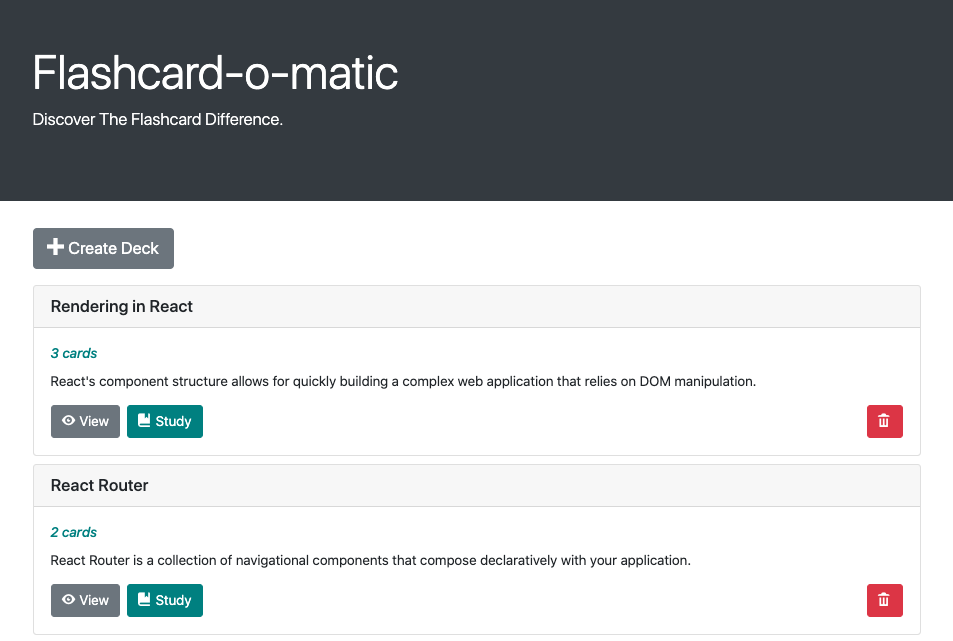
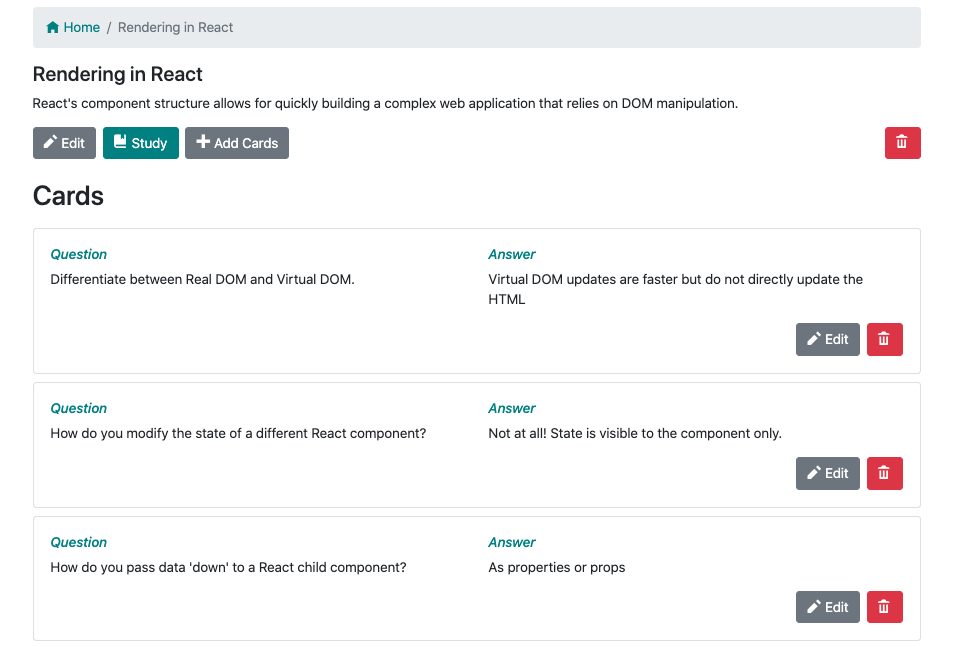
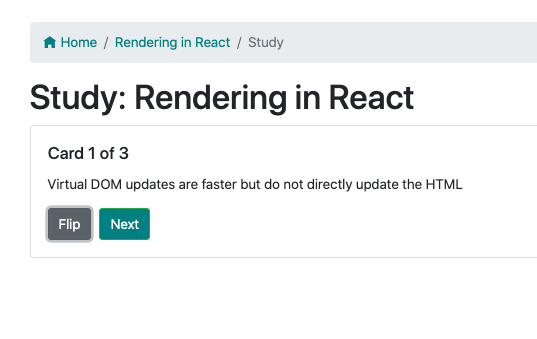
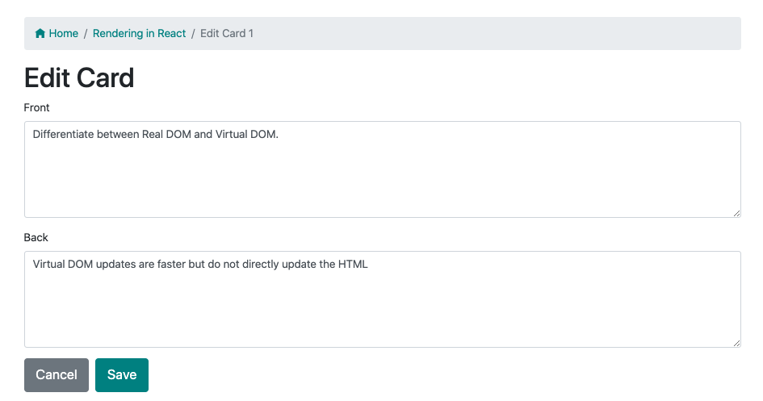
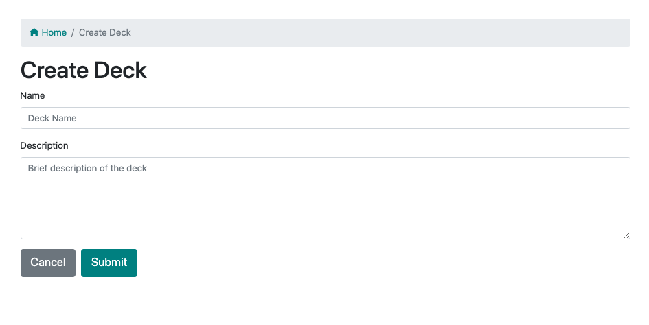
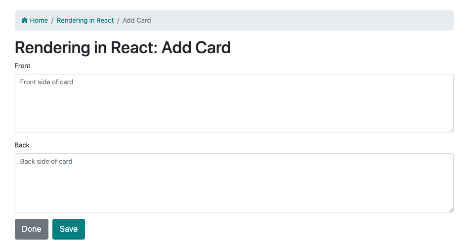
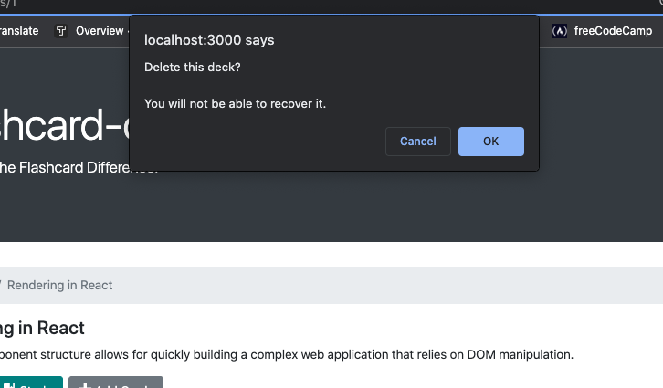

# Flashcard-o-matic_Project
Flashcard-o-matic is a web application that allows users to create, study, view, delete and edit flashcards.
It is intended to be used not just by teachers and students, but as a way for anyone to learn and memorize their topic of choice.
This is my frontend capstone project with [Thinkful](https://www.thinkful.com/bootcamp/web-development/).

## Screenshots
### Home Page
The home screen displays a "Create Deck" button, the currently available flashcard decks, and the option to "View," "Study," or delete a deck.

### View Deck
Clicking the "view" button leads to the deck screen where the user can view all cards contained in the deck. There are options to edit, study, delete or add cards to the deck, as well as edit or delete individual cards.

### Study Deck
Clicking the "study" button leads to the chosen deck's study screen. The front side of the first card in the deck is displayed first, and the user can then flip to the back of the card and click "next" to move on. At the end of the deck, the browser window prompts the user to either restart the deck or return to the home page.

### Edit Deck/Card
Clicking "edit" under the chosen deck or card leads to a form prefilled with information from the deck/card. The user can edit the info, and clicking "Submit" leads back to the deck page.

### Create Deck
Clicking the "Create Deck" button from the home page leads to a form where the user can input info for "Name" and "Description." Clicking "Submit" leads to the created deck's page.

### Add Card
Inside the deck screen, the user can click "Add Cards." A form is displayed with the options to add info to the front and back of the card.

### Delete Prompt
Clicking any of the trashcan icons brings up a prompt in the browser, verifying if the user wants to delete the deck or card.

## Additional Features
- Navigating to an unlisted url displays "Not Found"
- Clicking the "Study" button when the chosen deck has fewer than 3 cards leads to a page displaying a message "Not enough cards" and an "Add Cards" button.
- The nav bar under the header contains a link to "Home" on every page.

## Built with:
- React
- React Router
- JavaScript
- [Bootstrap CSS](https://github.com/twbs/bootstrap)

Created with [create react app](https://github.com/facebook/create-react-app)

The `<AddCard>` and `<EditCard>` components utilize the same <CardForm> component.

😊

